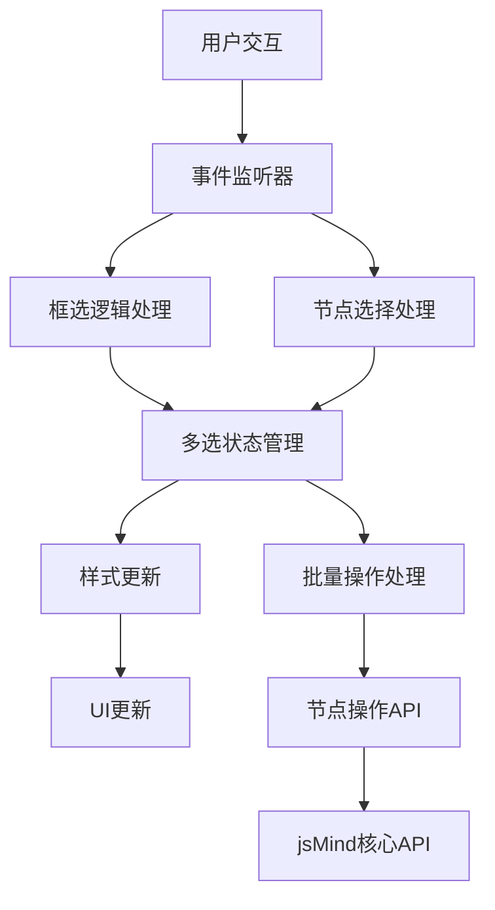
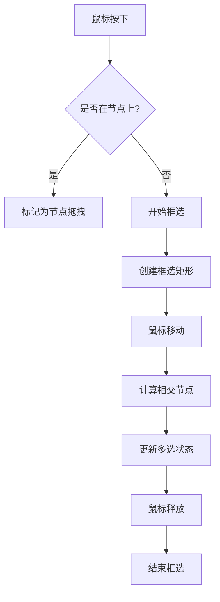

# 节点选择与批量操作功能设计文档

## 1. 概述

本设计文档描述了在思维导图应用中实现节点框选、拖拽选中样式、点击空白处清空选中以及支持批量移动和删除功能的实现方案。该功能旨在提升用户在处理多个节点时的操作效率。

## 2. 功能需求

### 2.1 核心功能
- [x] 框选多个节点
- [x] 拖拽选中样式
- [x] 点击空白处清空选中
- [x] 批量移动节点
- [x] 批量删除节点

### 2.2 扩展功能
- [x] Shift+点击多选
- [x] 双击切换节点选择状态
- [x] 键盘快捷键支持（Delete键删除）
- [x] 空格键拖拽画布

## 3. 现有实现分析

### 3.1 已实现功能
当前实现已包含以下功能：
1. 基于鼠标事件的框选功能
2. 多选状态管理（使用Set数据结构）
3. 高亮显示选中节点的样式
4. 批量删除和移动功能
5. 点击空白区域清空选择
6. Shift+点击多选支持
7. 双击切换节点选择状态

### 3.2 存在问题与改进点
1. **样式优先级问题**：需要确保多选样式覆盖jsMind默认选中样式
2. **事件冲突处理**：避免框选与节点拖拽事件冲突
3. **性能优化**：大量节点时的框选计算优化
4. **用户体验**：增强视觉反馈和操作提示

## 3. 技术架构

### 3.1 整体架构


### 3.2 核心组件

#### 3.2.1 多选状态管理器
- 使用Set数据结构存储选中的节点ID
- 提供添加、删除、清空等操作接口
- 维护选中状态与UI显示的一致性

#### 3.2.2 框选处理器
- 监听鼠标事件（mousedown, mousemove, mouseup）
- 计算框选区域与节点的相交关系
- 实时更新多选状态

#### 3.2.3 批量操作处理器
- 提供批量删除功能
- 提供批量移动功能
- 处理操作确认和错误处理

### 3.3 技术实现要点

#### 3.3.1 事件处理机制
1. **事件绑定策略**：
   - mousedown和mousemove事件绑定到.jsmind-inner容器
   - mouseup事件绑定到window对象，防止快速拖动时事件丢失
   - 使用非捕获阶段绑定，避免干扰jsMind原生事件处理

2. **事件冲突解决**：
   - 检测鼠标按下位置是否在节点上
   - 如果在节点上则标记为节点拖拽，禁用框选
   - 多选节点拖拽时阻止jsMind拖拽插件的默认行为

#### 3.3.2 样式管理
1. **高优先级样式**：
   - 使用`!important`标记确保样式生效
   - 采用具体的选择器路径提升CSS优先级
   - 覆盖jsMind默认的.selected样式

2. **样式应用与清除**：
   - updateHighlight()函数负责统一管理样式
   - 先清除所有节点的.multi-selected类
   - 再为选中节点添加.multi-selected类

#### 3.3.3 性能优化
1. **防抖处理**：
   - 框选过程中延迟更新选中状态
   - 移动超过阈值(>4px)才真正开始框选

2. **节点查询优化**：
   - 优先使用[nodeid]属性选择器查询节点
   - 备用方案使用.jmnode类选择器

3. **样式更新优化**：
   - 只在选中状态发生变化时更新UI

## 4. 详细设计

### 4.1 框选功能实现

#### 4.1.1 框选逻辑流程


#### 4.1.2 关键实现细节
1. **事件监听**：
   - 在`.jsmind-inner`容器上监听鼠标事件
   - mouseup事件绑定到window以防止事件丢失

2. **框选区域计算**：
   - 使用`getBoundingClientRect()`获取节点位置
   - 计算框选矩形与节点的相交关系

3. **多选状态管理**：
   - 使用Set存储选中节点ID
   - 提供`updateHighlight()`函数更新UI显示

4. **拖拽检测**：
   - 检测鼠标按下时是否在节点上
   - 如果在节点上则标记为拖拽状态，禁用框选
   - 智能拖拽检测：鼠标按下时未检测到节点但移动时检测到节点则认为是拖拽

5. **添加模式支持**：
   - 按住Shift或Meta键时启用添加模式
   - 添加模式下不会清空已有选择
   - 替换模式下会实时移除未命中的节点

### 4.2 拖拽选中样式

#### 4.2.1 样式设计
```css
.multi-selected {
  background-color: rgba(76, 154, 255, 0.8) !important;
  border: 4px solid #4c9aff !important;
  transform: scale(1.08) !important;
  box-shadow: 0 0 0 4px #4c9aff, inset 0 0 0 3px #4c9aff, 
              0 6px 20px rgba(76, 154, 255, 0.6), 
              0 0 30px rgba(76, 154, 255, 0.4) !important;
  animation: pulse 1.2s infinite ease-in-out !important;
  color: #fff !important;
  font-weight: bold !important;
  z-index: 999 !important;
}
```

#### 4.2.2 样式应用机制
- 通过`updateHighlight()`函数应用和移除样式
- 使用高优先级CSS选择器确保样式生效
- 添加动画效果提升用户体验

### 4.2.3 样式优先级处理
为确保多选样式能够正确显示，采用以下策略：
1. 使用完整的CSS选择器路径提升优先级
2. 为所有关键样式属性添加`!important`标记
3. 专门处理jsMind默认选中样式与多选样式的冲突
4. 为单选和多选节点分别定义样式规则

### 4.3 点击空白处清空选中

#### 4.3.1 实现逻辑
1. 在mousedown事件中检测点击位置
2. 如果点击位置不在节点上且不在工具栏上，则清空选中状态
3. 调用`multiSelected.clear()`和`updateHighlight()`更新UI

### 4.4 批量操作功能

#### 4.4.1 批量删除
- 支持Delete/Backspace键快捷删除
- 提供确认对话框防止误操作
- 调用`jm.remove_node()`删除节点

#### 4.4.2 批量移动
- 提供移动模式激活功能
- 用户点击目标节点完成移动操作
- 支持ESC键取消操作

### 4.4.3 批量操作的特殊处理
1. **多选节点拖拽**：
   - 当拖拽多选节点时，为所有选中节点添加拖拽时的视觉反馈
   - 拖拽结束时恢复节点原始样式
   - 阻止jsMind拖拽插件处理多选节点，避免错误

2. **批量移动的实现**：
   - 设置批量移动模式标记
   - 显示操作提示信息
   - 用户选择目标节点后，将所有选中节点移动到目标节点后
   - 支持ESC键取消操作

## 5. API接口设计

### 5.1 全局函数
| 函数名 | 参数 | 描述 |
|--------|------|------|
| `window.getMultiSelection()` | 无 | 获取当前选中的节点ID数组 |
| `window.clearMultiSelection()` | 无 | 清空所有选中节点 |
| `window.selectMultipleNodes(ids)` | `ids`: 节点ID数组 | 选中指定的多个节点 |
| `window.batchDelete()` | 无 | 执行批量删除操作 |
| `window.batchMove()` | 无 | 执行批量移动操作 |
| `window.debugMultiSelect()` | 无 | 调试多选样式应用情况 |

### 5.2 内部函数
| 函数名 | 参数 | 描述 |
|--------|------|------|
| `setupBoxSelection()` | 无 | 初始化框选功能 |
| `updateHighlight()` | 无 | 更新选中节点的样式显示 |
| `rectsIntersect()` | `a, b`: 矩形对象 | 判断两个矩形是否相交 |
| `onMouseDown()` | `e`: 鼠标事件对象 | 处理鼠标按下事件 |
| `onMouseMove()` | `e`: 鼠标事件对象 | 处理鼠标移动事件 |
| `onMouseUp()` | 无 | 处理鼠标释放事件 |

## 6. 用户界面设计

### 6.1 批量操作工具栏
- 显示选中节点数量
- 提供删除、移动、清除按钮
- 提供调试按钮用于开发调试

### 6.2 视觉反馈
- 选中节点高亮显示
- 框选过程中显示半透明矩形
- 操作成功/失败提示信息

### 6.3 拖拽视觉反馈
- 多选节点拖拽时添加透明度和缩放效果
- 拖拽结束时恢复原始样式
- 提供拖拽过程中的动画效果

## 7. 键盘快捷键

| 快捷键 | 功能 |
|--------|------|
| Shift+点击 | 切换节点选中状态 |
| Delete/Backspace | 删除选中节点 |
| 空格键+拖拽 | 拖拽画布 |
| ESC | 取消批量移动模式 |

## 8. 错误处理与异常情况

### 8.1 常见异常情况
1. 节点元素无法找到
2. 框选区域计算错误
3. 批量操作执行失败
4. 样式应用失败

### 8.2 处理策略
- 使用try-catch捕获异常
- 提供友好的错误提示信息
- 保证核心功能不受影响

## 9. 性能优化

### 9.1 优化措施
1. 使用防抖机制减少样式更新频率
2. 优化框选区域计算算法
3. 使用事件委托减少内存占用
4. 合理使用CSS选择器优先级

## 10. 测试方案

### 10.1 功能测试
- 框选多个节点功能测试
- 拖拽选中样式显示测试
- 点击空白处清空选中测试
- 批量删除功能测试
- 批量移动功能测试
- Shift+点击多选功能测试
- 双击切换节点选择状态测试
- 空格键拖拽画布功能测试

### 10.2 兼容性测试
- 不同浏览器兼容性测试
- 不同屏幕分辨率适配测试
- 触摸设备支持测试

### 10.3 性能测试
- 大量节点时的框选性能测试
- 样式更新性能测试
- 批量操作响应时间测试

## 11. 部署与维护

### 11.1 部署注意事项
- 确保CSS样式优先级设置正确
- 验证事件监听器绑定无误
- 测试批量操作功能完整性
- 验证不同浏览器的兼容性

### 11.2 维护建议
- 定期检查样式兼容性问题
- 监控用户使用反馈
- 持续优化性能表现
- 根据用户反馈改进交互体验

## 12. 未来扩展

### 12.1 可能的改进方向
1. **增强框选功能**：
   - 支持Ctrl+A全选功能
   - 支持反向选择功能
   - 添加框选过滤器（按类型、层级等）

2. **扩展批量操作**：
   - 批量修改节点属性
   - 批量应用样式模板
   - 批量导出节点

3. **交互优化**：
   - 添加选中节点的统计信息
   - 支持选中节点的快速搜索
   - 提供选中节点的预览功能