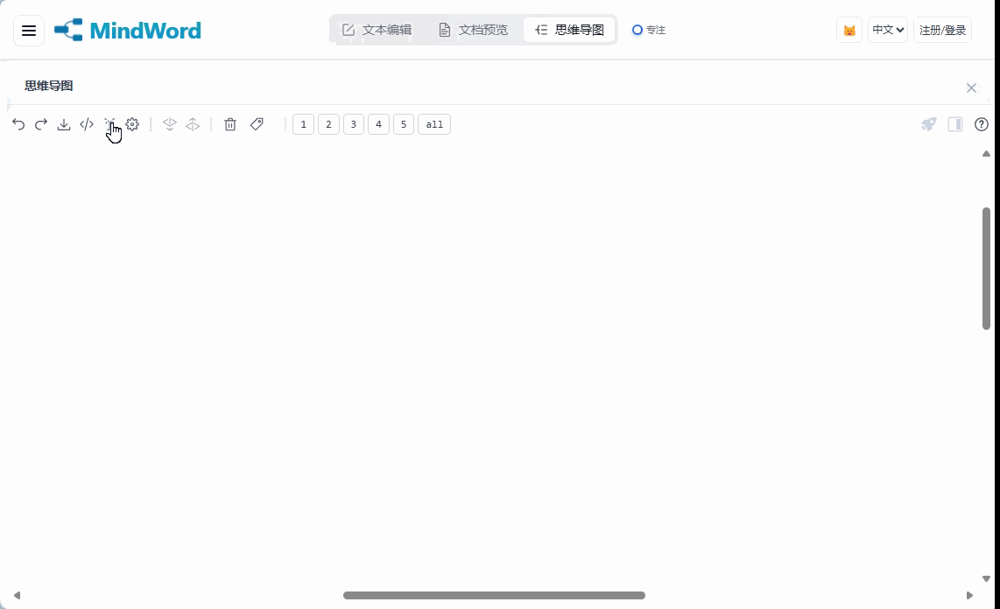

## 1.0.6 (2025/12/23)
1. 成功上架微软应用商店啦，搜索MindWord即可安装应用！已添加微软应用商店链接到网站；
2. 修复同步预览弹窗重叠问题；

---
## 1.0.5 (2025/12/22)
1. 添加页面“支持一下”，可以通过点赞/反馈/分享/看广告等方式来提供支持；
---
## 1.0.4 (2025/12/21)
1. 顶部多个非主要功能合并到“更多”菜单中，界面更简洁；

---

## 1.0.3 (2025/12/20)
1. 添加用户反馈页面和入口；
2. 支持快捷举报AI生成的内容；

---
## 1.0.2 (2025/12/19)
1. 移除exe下载功能，后续可在微软商店安装；
---
## 1.0.1 (2025/12/16)
1. 增加多端图标支持；
2. 增加隐私政策页面；
---
## 1.0.0 (2025/12/15)
### 功能
1. 图片存储从localstorage改为IndexDB，支持本地存储更多更大的图片；
2. 思维导图中支持查看备注内图片；
3. 支持点击图片查看预览，支持缩放、移动等操作；

---

## 0.58 (2025/12/9)
### 功能
1. 全面优化PWA安装功能（支持把应用安装到本地且离线使用大部分功能，注册登录云同步和AI功能除外）；

---
## 0.57 (2025/12/7)
### 功能
1. 初步支持PWA；
2. 增加快速生成子目录菜单以及移动端交互（不完全适配）

### BUG
1. 修复配置AI之后报不支持此平台
---

## 0.56 (2025/12/5)
### 功能
1. 首页新增windows的exe桌面端下载；
2. 统一LOGO样式；

## 0.55 (2025/12/4)
### 功能
1. 用户认证和数据同步预览页面支持国际化；
2. 登录后自动同步，且自动同步频率为24h一次； 
3. 添加对西班牙语（Español）的国际化支持；

### BUG
1. 解决editor内粘贴表格无法识别的bug；
---
## 0.54 (2025/12/03)
### 功能
1. 思维导图导出PNG边距调整，并支持显示节点边框；

### BUG
1. 修复思维导图在专注模式或刷新后布局挤压问题，现在切换面板时会自动重新布局
2. 修复 AI 生成 Markdown 时标题中多余的 `**` 粗体标签问题
3. 修复 AI 生成的列表节点被错误转换为标题节点的问题
4. 修复 如果人为填入Markdown 粗体格式（`**文本**`）在思维导图中不显示加粗效果的问题
5. 修复截图下载时粗体文字显示 `</strong>` 标签而不是加粗效果的问题，现在截图中的粗体文字会正确显示为加粗
6. 美化滚动条样式

### 开源
1. 我”想开“啦，添加了github开源项目地址到首页：https://github.com/TimiKays/MindWord
---

## 0.53 (2025/12/01)
### 功能
1. 去掉问卷填写入口；

### BUG
1. 修复官网重复加载问题；

---

## 0.52 (2025/11/23)
### 功能
1. 增加问卷填写入口（中文+English）；

---

## 0.51 (2025/11/22)
### 优化
1. 网站SEO优化，处理爬虫被禁的问题；

---

## 0.5 (2025/11/21)——无需配置即可使用AI生成啦🎈

### 功能

1. 增加更新日志功能和文档；
2. 移除编辑器顶部多余的删除按钮；

### BUG
1. 生产环境支持免配置直接调用AI生成功能（解决CROS问题，属于worker配置错误）

---

## v0.43 (2025/11/20)

### 功能
1. 新增ZIP导入时ID冲突处理功能
2. 新增工具栏按钮国际化支持
3. 统一并增强文档同步功能，支持图片数据

### BUG
1. 修复批量和单个文档导入导出图片丢失问题

---

## v0.42 (2025/11/17)

### 功能
1. 新增PNG下载背景色、文件名设置
2. 新增PNG导出水印选项，默认关闭
3. 新增根据内容标题生成导出文件名
4. 新增PNG下载包含全部/可见节点配置项
5. 新增右键菜单国际化支持
6. 新增复制图片到剪贴板功能

### UI
1. 优化PNG下载模态框布局和样式
2. 调整水印图片最小宽度为100像素
3. 新增首页producthunt卡片

---

## v0.41 (2025/11/15)

### BUG
1. 修复AI返回结果未移除根节点问题

---

## v0.4 (2025/11/11)

### 功能
1. 新增复制按钮国际化支持（中/英文）
2. 新增SEO优化配置和网站地图
3. 新增robots.txt和sitemap.xml文件
4. 修改index.html添加SEO元标签等资源
5. 修改页面标题和图片alt属性
6. 修改站点地图

---

## v0.39 (2025/11/09)

### BUG
1. 修复文本框内编辑无法撤销的问题。

---

## v0.38 (2025/11/08)

### 功能
1. 新增AI生成初始树支持中心主题和快速模式
2. 新增快速AI模式支持并优化生成流程
3. 新增节点右键菜单支持删除等操作
4. 新增自动去掉AI返回子树单个根节点功能
5. 新增模态框组件用于AI主题输入

### BUG
1. 修复AI生成时侧边栏未立即隐藏问题
2. 修复思维导图二次下钻丢失面包屑问题
3. 修复平台为空时从保存配置自动选择平台
4. 修复Mini模式切换完整模式提示配置AI平台bug

---

## v0.37 (2025/11/07)

### BUG
1. 修复用户提示词下拉框显示及内容问题
2. 解决文档预览时高亮包含子级问题
3. 修复迷你模式切换模板二次确认弹窗逻辑
### UI
1. 优化新建文档对话框样式
2. 批量模式下调整文档名称对齐方式
3. AI弹窗迷你模式输入框支持调整高度
4. 调整文档按钮CSS样式
### 功能
1. 迷你模式添加自定义标签选项及逻辑
2. AI弹窗迷你模式支持调整输入框高度
3. 添加文档时支持AI生成初始树

---

## v0.36 (2025/11/06)

### BUG
1. 修复下钻视图撤销重做问题
2. 解决AI组件初始化报错问题
3. 修复节点详情表单不显示纯数字内容的bug

### 功能
1. 新增playwright端到端测试配置
2. 新增2个简单测试用例

---

## v0.35 (2025/11/05)

### 功能
1. 新增思维导图节点下钻及返回功能
2. 新增下钻按钮和面包屑导航UI组件
3. 新增URL参数控制下钻状态功能
4. 新增下钻模式数据同步到原始数据功能

### BUG
1. 解决刷新时i18n键名闪烁问题

---

## v0.34 (2025/11/03)

### UI
1. 调整认证用户界面按钮宽度，区分PC和移动端
2. 迷你模式改为横向展开显示模板名称，下面是输入框

### BUG
1. 同步时勾选无文档的一方应删除另一方
2. 避免同步自动生成的AI平台配置，且只有英文模式生成

### 功能
1. 新增提示词模板按最近使用时间降序，显示最近9个

---

## v0.33 (2025/11/02)

### BUG
1. 解决AI弹窗顶部放大和关闭按钮无法点击问题
### UI
1. 优化移动端认证区域和语言切换样式防止换行

---

## v0.32 (2025/10/31)

### 功能
1. 新增按文档隔离的撤销重做功能
2. 修改语言选择器位置至个人菜单

### UI
1. 优化语言选择器样式和尺寸
2. 修复汉堡图标移动端不显示问题
3. 优化工具栏按钮显示，支持横向滚动
4. 删除同步弹窗多余提示

### BUG
1. 修复多文档切换后撤销到其他文档的问题
2. 修复切换文件后首次操作无法撤销的问题
3. 修复切换文档后再次切换回来无法撤销的问题
4. 修复首次切换文档时mindmap未更新的问题

---

## v0.31 (2025/10/30)

### 功能
1. 新增自动清理未命名空文档功能
2. 修改为用户手动创建空文档
3. 新增文档列表拖拽排序功能
4. 新增思维导图层级展开按钮组
5. 新增思维导图配置按钮
6. 为提示词模板添加元数据支持

### UI
1. 优化同步界面和冲突处理流程
2. 优化文档项样式和交互体验
3. 新增层级展开按钮样式并优化布局

---

## v0.3 (2025/10/29)

### 功能
1. 新增用户模板搜索输入框及交互体验增强
2. 新增迷你模式模板搜索下拉框及功能同步
3. 新增从模板管理器直接应用模板功能
4. 新增我的文档列表批量操作功能
5. 新增用户提示词模板本地存储支持
6. 新增迷你模式与完整模式模板选择同步

### UI
1. 新增固定顶部和筛选区域样式类
2. 重构迷你模式界面布局，调整搜索框位置

### BUG
1. 修复模板切换时内容同步问题

---

## v0.29 (2025/10/28)

### 功能
1. 新增用户提示词模板管理功能
2. 新增模板选择、自动应用和自定义编辑功能
### UI
1. 新增移动端响应式布局优化
2. 修改z-index值解决界面层级问题

---

## v0.28 (2025/10/27)

### BUG
1. 修复同步状态显示不准确问题
2. 修复退出登录按钮事件绑定问题
### UI
1. 改进同步状态时间显示和颜色提示
2. 优化移动端样式和交互体验

---

## v0.27 (2025/10/25)

### 功能
1. 新增节点批量复制粘贴功能
2. 新增Ctrl+X剪切节点功能
3. 新增无弹窗模式AI请求动画显示
4. 新增三层提示词结构

### BUG
1. 修复图标无法清空和替换的bug
2. 修复AI设置按钮点不动的问题
3. 修复序号图标无法清除的问题
4. 修复编辑状态下禁止粘贴节点的问题
5. 修复AI组件输出框两层滚动条的问题

---

## v0.26 (2025/10/24)

### BUG
1. 解决AI弹窗完整状态下无法添加子级的问题
2. 修复备注变化时视图未更新备注图标显示的问题

---

## v0.25 (2025/10/23)

### 功能
1. 新增思维导图AI功能支持迷你模式
2. 新增同步迷你模式与完整模式的输入和占位符
3. 新增思维导图撤销重做功能和配置按钮
4. 新增AI操作的撤销管理支持
5. 新增思维导图无弹窗快速AI生成模式
6. 新增快速AI生成开关按钮

### BUG
1. 修复添加同级节点通知问题，调整通知显示持续时间

---

## v0.24 (2025/10/22)

### 功能
1. 新增AI服务模态框用户提示词及无弹窗调用模式
2. 新增AI服务弹窗迷你模式界面及切换功能
3. 优化AI服务弹窗markdown解析逻辑
4. 修改AI服务弹窗默认以迷你模式启动
5. 允许AI服务模态框空用户提示词发送
6. 新增AI服务模态框迷你模式输入框提示文字功能

---

## v0.23 (2025/10/21)

### 功能
1. 新增个人菜单并整合云同步功能
2. 新增国际化支持及中英文切换功能
3. 新增官网首页中英文切换功能

### UI
1. 添加用户下拉菜单及云同步状态显示
2. 优化移动端样式和交互体验
3. 重构帮助文档显示逻辑及模态框展示
4. 调整响应式断点至1020px适配设备

### BUG
1. 修复AI组件保存配置缺少platformName字段问题
2. 修复文档删除标记同步及数据一致性问题
3. 修复同步后当前文档被删除的处理逻辑

---

## v0.22 (2025/10/19)

### 功能
1. 新增国内网络数据增量同步(按语言区分环境)
2. 新增同步后自动刷新文档列表功能

---

## v0.21 (2025/10/18)

### 功能
1. 新增云端同步功能，支持上传、清空和10MB容量限制。

---

## v0.2 (2025/10/17)

### 功能
1. 新增用户认证系统及界面
2. 新增auth.html实现登录/注册/找回密码功能
3. 在app.html添加用户状态显示和退出功能
4. 新增移动端支持注册登录
5. 新增支持重发验证邮件功能
6. 新增功能需求文档和项目说明文档
7. 修改登录错误处理，添加友好错误提示

### UI
1. 调整通知容器位置避免重叠
2. 优化专注模式按钮样式和通知样式
3. 调整移动端认证区域样式，隐藏专注按钮
4. 优化登录注册页面UI设计和交互体验
5. 添加渐变背景和卡片悬浮效果增强视觉吸引力
6. 优化表单输入和按钮的交互反馈
7. 改进响应式设计适配移动设备

### BUG
（无相关内容）

---

## v0.19 (2025/10/16)

### 功能
1. 新增我的文档侧滑样式和功能
2. 新增AI弹窗打开时自动刷新配置功能
3. 新增我的文档清空数据按钮

### UI
1. 修改AI组件模型下拉框跟随应用界面平台选择

### BUG
1. 解决生成初始树必须刷新整个页面问题
2. 删除移动端禁用空格+拖拽代码

---

## v0.18 (2025/10/15)

### 功能
1. 新增index页面为介绍页，支持从使用页跳转
2. 新增无平台配置用户通过cf转发发送AI请求
3. 新增节点悬停/选中显示快捷操作按钮
4. 新增备注时显示笔记图标，点击进入详情
5. 新增截图过大处理功能
6. 新增切换多份文档支持（样式待调整）

### BUG
1. 修复修改文档后切换丢失的问题

---

## v0.17 (2025/10/14)

### 功能
1. 新增AI弹窗动态标题功能
2. 新增面板状态持久化功能
3. 新增AI弹窗平台和模型记忆功能
4. 新增AI弹窗输出结果编辑功能

### BUG
1. 修复AI弹窗发送消息修改密钥报错问题
2. 修复AI弹窗点击外部自动关闭问题
3. 修复添加子级和生成初始树bug

---

## v0.16 (2025/10/13)

### 功能
1. 新增魔搭社区支持，每日2000额度
2. 新增智谱AI平台和内置免费模型
3. 新增内置key和GLM-4-Flash免费模型
4. 新增着陆页样式和交互功能
5. 修改节点详情面板移动端默认关闭但保留访问能力
6. 修改AI服务弹窗添加移动端响应式布局
7. 修改按钮和表单元素移动端触摸体验
8. 修改网格布局和间距适应不同屏幕尺寸

### UI
1. 修改节点详情面板显示逻辑
2. 新增着陆页导航栏滚动和平滑滚动锚点效果

---

## v0.15 (2025/10/12)

### 功能
1. 新增AI扩写备注功能
2. 修改思维导图AI快捷操作按钮为图标
3. 新增思维导图支持批量删除功能
4. 修改节点详情面板按钮为图标

### UI
1. 修改思维导图AI快捷操作按钮样式
2. 修改AI组件弹窗高度为自动
3. 修改节点详情弹窗按钮空状态下隐藏

---

## v0.14 (2025/10/11)

### 功能
1. 新增跑通新AI组件生成子节点流程
2. 新增创建同级功能，增强导图编辑
3. 新增扩写备注功能，增强导图编辑
4. 新增生成初始树功能，增强导图编辑
### BUG
1. 修复切换实际值模式后无法切换占位符模式的bug
2. 解决应用模板后实际值和占位符内容不一致问题

---

## v0.13 (2025/10/10)

### 功能
1. 新增思维导图调用新AI组件
2. 修改组件布局
3. 修改进入时默认占位符模式

---

## v0.12 (2025/10/08)

### 功能
1. 新增AI组件获取参数用于编辑提示词功能
2. 新增无弹窗AI调用模式及模板处理优化

---

## v0.11 (2025/10/07)

### 功能
1. 新增AI弹窗组件设计文档及演示示例
2. 实现AI弹窗与父窗口双向通信及跨iframe调用

---

## v0.1 (2025/10/05)

### 功能
1. 新增AI调用组件支持多平台、多模板

---

## v0.09 (2025/10/04)

### 功能
1. 新增详情面板自动跟随选中节点功能
2. 新增详情面板空状态提示
3. 新增详情面板三态图标按钮
4. 修改详情面板交互体验

### UI
1. 优化详情面板样式

### BUG
1. 修复点击选中文字光标不显示问题
2. 删除ui.js
3. 取消按钮点击后自动位移逻辑

---

## v0.08 (2025/10/03)

### BUG
1. 修复无法点击查看详情的bug
2. 修复无法下载图片的bug
3. 修复下载word的bug
4. 修复内联编辑输入空格丢失焦点问题

---

## v0.07 (2025/10/02)

### BUG
1. 修复新增过多子节点后样式错乱问题
2. 修复节点详情开关误触发问题
3. 修复选中节点被输入框挡住问题
4. 修复输入框选中文本丢失焦点问题
5. 修复查看详情功能bug
6. 修复无法查看详情、下载图片bug

### UI
1. 备注输入框高度调整
2. 调整tab样式
3. 调整样式

---

## v0.06 (2025/10/01)

### 功能
1. 新增支持更大范围拖拽功能
2. 新增支持按百分比计算整体偏移量

### BUG
1. 修改jsmind源码，解决初始化后多次跳动问题
2. 解决拖拽功能多次跳动和多重滚动条问题

---

## v0.05 (2025/09/30)

### 功能
1. 新增readme文档
2. 新增分组图标模块并优化图标选择器
3. 修改思维导图默认缩放比例为0.8
4. 隐藏mindmap的2个无用复选框
5. 删除editor的查看json按钮

### UI
1. 通知样式缩小
2. 若干样式调整
3. 思维导图适配移动端

### BUG
1. 修复批量拖拽节点后层级不更新问题
2. 解决版本不一致导致无法下载png问题

---

## v0.04 (2025/09/29)

### UI
1. 优化导航栏品牌文字渐变和标签样式
2. 统一编辑器保存提示为全局通知
3. 调整编辑器和预览框样式

### BUG
1. 解决思维导图单选样式未自动取消问题
2. 解决选中节点时焦点偏移到editor的问题
3. 部分解决思维导图操作后视图重置问题
4. 修复ctrl+z会滚动到根节点位置并保持同步
5. 修复围栏代码块和标题解析问题
6. 修复列表节点在引用或行内代码中处理问题

### 功能
1. 新增思维导图与编辑器节点同步高亮功能
2. 新增思维导图节点与预览界面同步高亮功能
3. 新增编辑模式下避免频繁弹通知功能
4. 新增只看标题的过滤开关功能
5. 新增标题锚点与目录跳转功能

---

## v0.03 (2025/09/28)

### 功能
1. 新增思维导图批量拖拽功能
2. 新增思维导图撤销重做功能及测试按钮
3. 新增撤销重做功能与本地资源整合
4. 新增思维导图现代简约主题
5. 新增移动端适配及底部导航栏

### UI
1. 修改移动端响应式布局，优化面板间距和样式

### BUG
1. 修复批量拖拽多选节点逻辑问题
2. 修复重做快捷键ctrl+shift+z支持问题

---

## v0.02 (2025/09/27)

### 功能
1. 新增支持框选样式功能

### UI
1. 修改截图插件为白色背景提升效果

### BUG
1. 解决缩放下selectionRect框选位置错位问题
2. 修复属性内多次写impotant的编译错误
3. 修复截图插件HTTPS安全警告问题
4. 删除截图插件测试文件去除水印

---

## v0.01 (2025/09/26)

### 功能
1. 新增多仓库同步脚本
2. 修改通知系统为容器式布局

### UI
1. 优化UI样式为现代简约风格
2. 简化按钮样式并确保iframe继承

### BUG
1. 修复编辑状态下的多选和拖拽冲突

---

